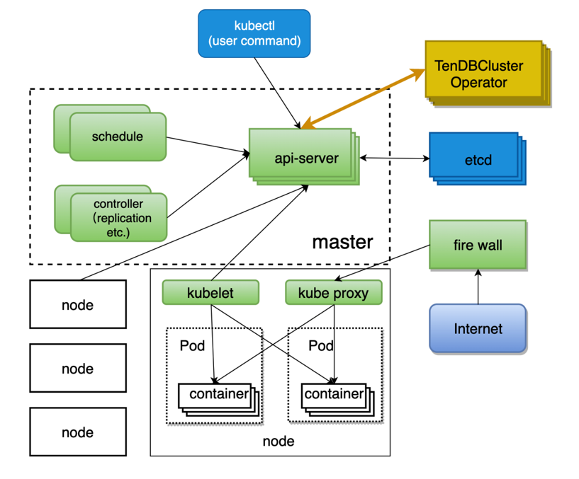
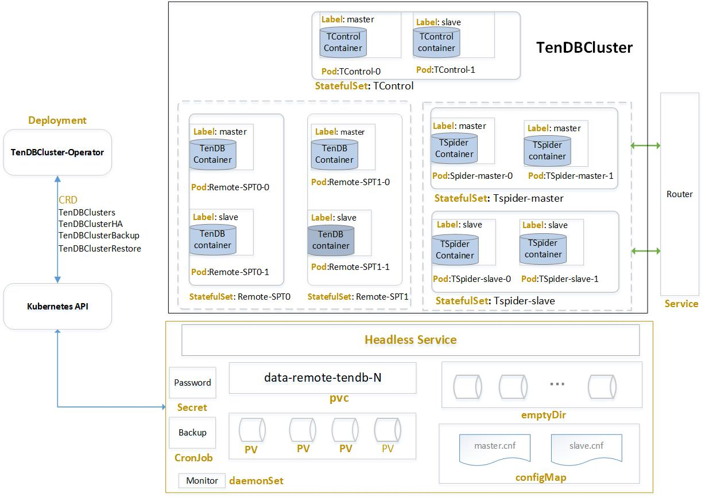
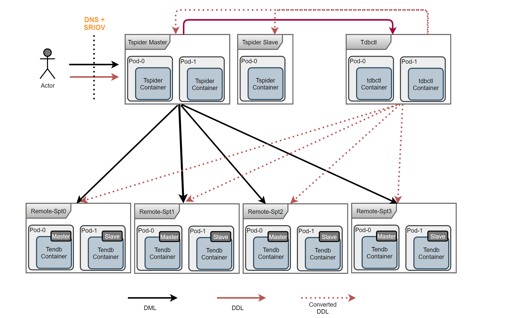

# TenDB Cluster Operator说明
Kubernetes声明式API的特性，使得应用无需修改Kubernetes代码，直接通过与Kubernetes API交互的方式自定义资源来扩展Kubernetes行为。这种声明式API的特性，使我们很方便就能在Kubernetes上进行二次开发实现自己的控制器，以我们希望的部署方式来调度、管理自己的容器服务。
我们通过实现自己的控制器TenDB Cluster Operator，将TenDB Cluster集群的部署、管理行为容器化，标准化，流程化。  
不同于常规部署流程，集群的资源调度统一由Kubernetes负责，任何与内存、CPU、磁盘等资源相关的操作，我们都通过TenDB Cluster Operator与Kubernetes API交互后申领使用; 集群的创建、扩缩容、高可用都由TenDBCluster Operator按已标准化、代码化的逻辑来运转，管理。   
TenDB Cluster Operator是基于operator-framework/operator-sdk开发的一个管理Kubernetes容器应用的方案，旨在部署我们的TenDB Cluster集群，做到高效、自动化、可伸缩、可扩展。目前能满足集群的快速部署，故障检测，故障切换，在线备份，故障恢复，性能监控预警，是一套完备、成熟的云上集群使用方案。在扩展性上，用户可以根据自己的需求进行二次开发，通过定义新的资源类型来扩展不同场景下的要求。  

## TenDB Cluster Operator架构图
下图是TenDB Cluster Operator与Kubernetes交互的一个简单说明，用户通过kubectl命令行或Kubernetes API与Kubernets交互，将资源对象写入Kubernetes的etcd，TenDB Cluster Operator周期性通过API读取资源对象，如果发现有未处理的资源对象，则响应处理   

## TenDB Cluster Operator组件说明  
TenDB Cluster Operator在实现上，最终还是将自定义的资源类型，解析为Kubernetes内置定义的Pod，Statefulset等资源类型，使用Kubernetes本身的控制器来调度管理容器.
下图是TenDB Cluster Operator对Kubernetes一些组件的使用

Kubernetes环境下，应用DDL，DML请求流程如下

