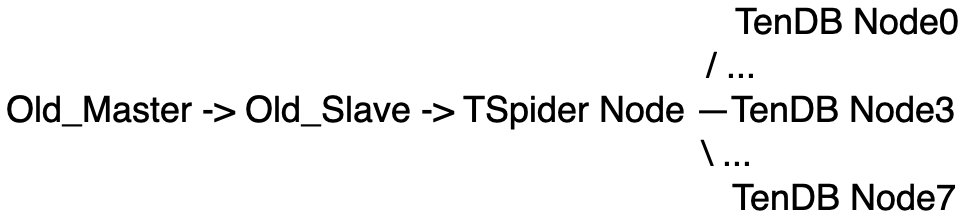

## Use pt-table-checksum To Checksum Data Between Master-Slave And TenDB Cluster

### Database Servers Information

Catagory | Address | Comment
---- | --- | ---
Old_Master | 9.140.195.189#3306 | 
Old_Slave |  9.140.196.209#3306 | 
TSpider Node | 9.95.73.147#3306 | using TSpider Node to do data migration from Old_Slave
TenDB Node | 9.186.2.250#20000-20007 | In my test environment, The TenDB Cluster has eight shards 

The data synchronization architecture is as follows, I assume that the data in Old_Master and Old_Slave is consistent




### Follow The Following Steps To Checksum Data Between Old_Slave And TenDB Cluster

+ Importing 2GB data into Old_Master (eogdata_server_felix.eogdata_files), almost 500000 rows

```
-rw-r--r-- 1 mysql mysql  2042961818 Mar 28 20:03 eogdata_files.sql
```

+ The imported data will be average distributed into eight shards(TenDB Nodes) by the TSpider Node

+ Now I use pt-table-checksum tool to checksum the data from Old_Slave and TSpider Node
	- 1. First I need to grant privileges to the tool, because I run the tool on machine 9.95.73.147, so I need to run the follow GRANT SQL on Old_Slave machine(9.140.196.209)

	``` 
	GRANT select,super,process on *.* to pt_check@9.95.73.147 identified by 'pt_check_pass'; 
	```

	- 2. Run the pt-table-checksum againts Old_Slave, and check the output; You can see more detail usage about this tool at [percona-toolkit](https://www.percona.com/doc/percona-toolkit/2.2/pt-table-checksum.html)

  ```
  perl /home/mysql/monitor/percona-toolkit-2.2.10/bin/pt-table-checksum -upt_check -ppt_check_pass --host=9.140.196.209 --port=3306 --chunk-size=1000 --check-interval=1 --replicate test.checksum --create-replicate-table --no-check-replication-filters --no-replicate-check --tables=eogdata_server_felix.eogdata_files
		
  Cannot connect to P=3306,h=9.140.196.209,p=...,u=pt_check
  Diffs cannot be detected because no slaves were found.  Please read the --recursion-method documentation for information.
  Checksumming eogdata_server_felix.eogdata_files:  29% 01:10 remain
  Checksumming eogdata_server_felix.eogdata_files:  60% 00:39 remain
  Checksumming eogdata_server_felix.eogdata_files:  90% 00:08 remain
  ```

	- 3. The tool will create a table named test.checksum, and write the checksum result into the table, we need to check the result using the following SQL, that is very important that: the SQL need to be runed at the TSpider Node.

  ```
  ADMIN@TENCENT64site[test]mysql> select count(*) from test.checksum;
  +----------+
  | count(*) |
  +----------+
  |      502 |
  +----------+
  1 row in set (0.000 sec)
		
  the tool split the table eogdata_server_felix.eogdata_files into 502 chunks
  ```

  ```
  ADMIN@TENCENT64site[test]mysql> select count(*) from test.checksum where this_crc <> master_crc or this_cnt <> master_cnt; 
  +----------+
  | count(*) |
  +----------+
  |        0 |
  +----------+
  1 row in set (0.001 sec)
		
  If not chunks have crc or cnt different, so it means that the data between old_slave and spider cluster is the same!
  ```


