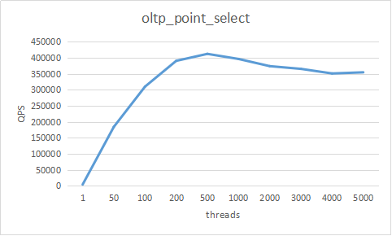
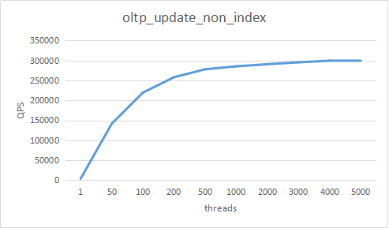

# TenDB Cluster 性能测试
本次测试涉及6台机器，其中一台机器作为Sysbench，两台作为TSpider节点。三台作为TenDB存储节点，每台机器四个TenDB实例，即后端12个分片。集群搭建，可以参考[集群安装](./op-guide/manual-install.md/#manual-install)。下面依次介绍测试的方法以及结果。

注：
>本次测试不涉及中控节点Tdbctl，可以在建表阶段安装中控节点，方便TenDB Cluster集群建表。


## 测试背景

### 软件版本

|  类别   | 名称  |
|  ----  | ----  |
|  TSpider | 3.4.5 |
| TenDB  |   3.1.5 |
| Sysbench  | 1.1.0 |

>Sysbench 1.1.0，可在[Sysbench 1.1.0下载页面](https://github.com/akopytov/sysbench)下载。

### 机器信息

|  类别   | 名称  |
|  ----  | ----  |
| OS  | Tencent tlinux release 1.2 |
| CPU  | 32  Intel(R) Xeon(R) CPU E5-2620 v4 @ 2.10GHz |
| RAM  | 128G |
| DISK  | SSD 2000.4 GB |


### 机器拓扑

|  机器IP   | 部署实例  |
|  ----  | ----  |
| 117.42.3.*  | Sysbench |
| 117.42.2.*   | TSpider |
| 117.42.4.*  | TSpider |
| 117.45.3.*  | TenDB*4 |
| 117.41.134.*   | TenDB*4 |
| 117.42.3.*  | TenDB*4 |
>后端一共12个TenDB实例，部署在3台机器上。

## 测试方法
将两个TSpider节点加入域名，并关闭Sysbench机器的DNS缓存，Sysbench通过域名向两个TSpider节点分发请求。在TSpider测创建10个表，每个表10G数据，分别测试全cache点查询，非索引点更新，索引点更新QPS。


### TSpider配置
TSpider开启了线程池，减少线程切换
```
thread_handling=pool-of-threads
thread_pool_oversubscribe=20
thread_pool_stall_limit=500
```

### TenBD配置
为每个TenDB实例分配25G  innodb_buffer_pool_size
```
innodb_buffer_pool_size=25G
```


### Sysbench配置
```
DB_DRIVER="mysql"
DB_HOST="domain_name"
DB_PORT=25000
DB_USER="mysql"
DB_PASSWORD="password"
DB_NAME="sbtest"
DB_ENGINE="innodb"
DB_RAND="uniform"          
TABLE_NUMS=10              
TABLE_SIZE=8500000           
MAX_REQUEST_NUM=0           
SELECT_TEST_TIME=300        
UPDATE_TEST_TIME=1200      
SUM_RANGES=0
REPORT_INTERVAL=20          
PERCENTILE_NUM=99                    
threads_num_array=(1 50 100 200 500 1000 2000) 
```


### 表结构
在small_table库下，建立10个相同的表，表结构如下：
```
MariaDB [small_table]> show create table sbtest10\G;
*************************** 1. row ***************************
       Table: sbtest10
Create Table: CREATE TABLE `sbtest10` (
  `id` int(11) NOT NULL AUTO_INCREMENT,
  `k` int(11) NOT NULL DEFAULT 0,
  `c` char(120) NOT NULL DEFAULT '',
  `pad` char(60) NOT NULL DEFAULT '',
  PRIMARY KEY (`id`),
  KEY `k_10` (`k`)
) ENGINE=SPIDER DEFAULT CHARSET=utf8
 PARTITION BY LIST (crc32(`id`) MOD 12)
(PARTITION `pt0` VALUES IN (0) COMMENT = 'database "small_table_0", table "sbtest10", server "SPT0"' ENGINE = SPIDER,
 PARTITION `pt1` VALUES IN (1) COMMENT = 'database "small_table_1", table "sbtest10", server "SPT1"' ENGINE = SPIDER,
 PARTITION `pt2` VALUES IN (2) COMMENT = 'database "small_table_2", table "sbtest10", server "SPT2"' ENGINE = SPIDER,
 PARTITION `pt3` VALUES IN (3) COMMENT = 'database "small_table_3", table "sbtest10", server "SPT3"' ENGINE = SPIDER,
 PARTITION `pt4` VALUES IN (4) COMMENT = 'database "small_table_4", table "sbtest10", server "SPT4"' ENGINE = SPIDER,
 PARTITION `pt5` VALUES IN (5) COMMENT = 'database "small_table_5", table "sbtest10", server "SPT5"' ENGINE = SPIDER,
 PARTITION `pt6` VALUES IN (6) COMMENT = 'database "small_table_6", table "sbtest10", server "SPT6"' ENGINE = SPIDER,
 PARTITION `pt7` VALUES IN (7) COMMENT = 'database "small_table_7", table "sbtest10", server "SPT7"' ENGINE = SPIDER,
 PARTITION `pt8` VALUES IN (8) COMMENT = 'database "small_table_8", table "sbtest10", server "SPT8"' ENGINE = SPIDER,
 PARTITION `pt9` VALUES IN (9) COMMENT = 'database "small_table_9", table "sbtest10", server "SPT9"' ENGINE = SPIDER,
 PARTITION `pt10` VALUES IN (10) COMMENT = 'database "small_table_10", table "sbtest10", server "SPT10"' ENGINE = SPIDER,
 PARTITION `pt11` VALUES IN (11) COMMENT = 'database "small_table_11", table "sbtest10", server "SPT11"' ENGINE = SPIDER)
1 row in set (0.000 sec)
```


## 测试结果
本次测试涉及10个表，每个表10G数据，用Sysbench分别测试全cache点查询，非索引点更新，索引点更新的QPS。
### oltp_point_select
全cache点查询测试，随机访问任意表，示例SQL如下：
```
SELECT c FROM sbtest%u WHERE id = ?;
```
全cache点查询测试结果如下：

|类型|  Thread   | TPS  | QPS |
|  ----  |  ----  | ----  | ----  | 
|point_select| 1  | 4337.78 |4337.78|
|point_select| 50   | 184582.52 |184582.52|
|point_select| 100   | 310235.15 |310235.15|
|point_select| 200  | 390781.56 |390781.56|
|point_select| 500  | 412636.22 |412636.22|
|point_select| 1000   | 396720.46 |396720.46|
|point_select| 2000  | 374260.8 |374260.8|
|point_select| 3000  | 365760.96 |365760.96|
|point_select| 4000  | 351385.57 |351385.57|
|point_select| 5000  | 354969.57 |354969.57|



<center>图1.点查询测试结果</center>


### oltp_update_non_index
全cache点更新测试，随机update一个普通列，示例SQL如下：
```
UPDATE sbtest%u SET c = ? WHERE id = ?;
```
全cache普通列点更新，测试结果如下：

|类型|  Thread   | TPS  | QPS |
|  ----  |  ----  | ----  | ----  | 
|update_non_index| 1  | 3715.15 |3715.15|
|update_non_index| 50   | 141638.82 |141638.82|
|update_non_index| 100   | 219505.11 |219505.11|
|update_non_index| 200  | 258207.39 |258207.39|
|update_non_index| 500  | 278102.5 |278102.5|
|update_non_index| 1000   | 285466.67 |285466.67|
|update_non_index| 2000  | 290867.04 |290867.04|
|update_non_index| 3000  | 295568.27 |295568.27|
|update_non_index| 4000  | 299684.85 |299684.85|
|update_non_index| 5000  | 298031.75 |298031.75|



<center>图2.普通列点更新测试结果</center>

### oltp_update_index
全cache点更新测试，随机update一个二级索引列，示例SQL如下：
```
UPDATE sbtest%u SET k = k + 1 WHERE id = ?;
```
全cache索引列点更新，测试结果如下：

|类型|  Thread   | TPS  | QPS |
|  ----  |  ----  | ----  | ----  | 
|update_index| 1  | 3450.85 |3450.85|
|update_index| 50   | 103702.93 |103702.93|
|update_index| 100   | 117468.89 |117468.89|
|update_index| 200  | 117671.24 |117671.24|
|update_index| 500  | 126799.28 |126799.28|
|update_index| 1000   | 135237.45 |135237.45|
|update_index| 2000  | 133524.89 |133524.89|
|update_index| 3000  | 129596.26 |129596.26|
|update_index| 4000  | 133139.1 |133139.1|
|update_index| 5000  | 126877.49 |126877.49|


<center>图3.索引列点更新测试结果</center>