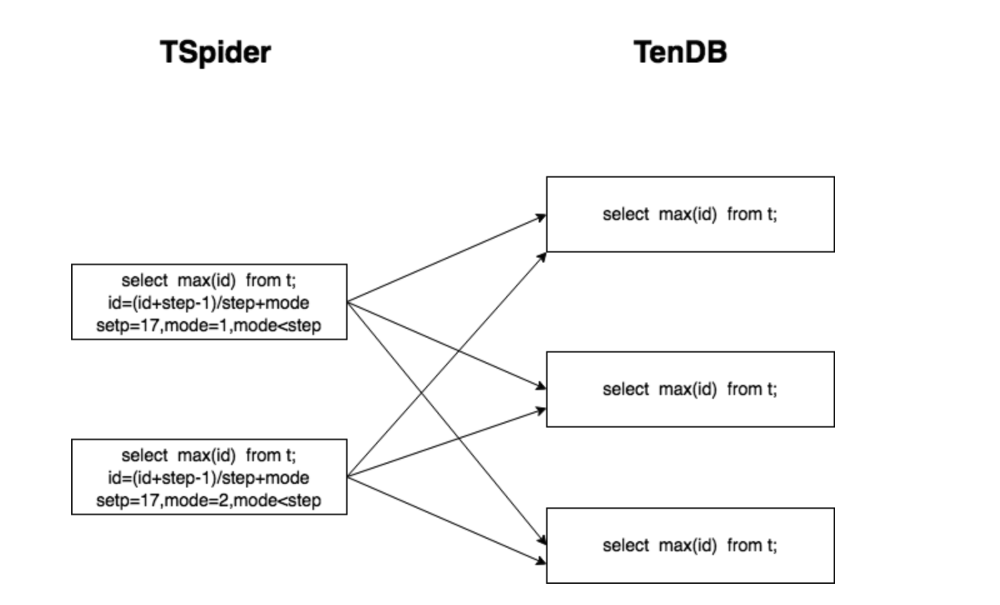

# TenDB Cluster Auto-increment Columns

TenDB Cluster only guarantees the uniqueness of the auto-increment column, and not guarantees that they are continuous and increment globally.  
In TenDB Cluster, a table will be distributed in multiple TenDB storage instances, and multiple TSpider nodes will read and write this table equally and simultaneously. Differing from single instance MySQL, an auto-increment column needs to be maintained by multiple TSpider nodes together.

To achieve the same behavior with that in single instance MySQL, All tables in TenDB Cluster must be locked when TSpider nodes update auto-increment column, or use third-party resource as a critical resource to ensure the uniqueness. Both solutions will introduce noticeable performance overhead, therefore it is not suitable for production environments.

The implementation strategy of auto-increment in TenDB Cluster is, to let each TSpider node maintain its own auto-increment column, and to make sure that the increment generated in each TSpider node is different to that generated in other nodes. Due to this autonomy, it can not be guaranteed that the auto-increment column is continuous and incremental in Cluster aspect, however, this approach has low cost in maintaining auto-increment column and high efficiency during updating them.   
In a word, TSpider will generate a global non-continuous unique identity for auto-increment.

It is recommended to enable TenDB Cluster auto-increment, and use bigint for auto-increment column 

## Usage

There are 3 parameters in each TSpider related to auto-increment column:

** `spider_auto_increment_mode_switch` **  
Whether the auto-increment is enabled. The value can be 0 (or OFF) to disable or 1 (or ON) to enable. If on, TSpider will generate a global non-continuous unique identity for new rows. Identity only ensure incremental on the same TSpider node.   

** `spider_auto_increment_step` **     
The step of the global non-continuous unique identity generated by TSpider node.  All TSpider nodes must be the same.     

** `spider_auto_increment_mode_value ` **  
TSpider node generate global non-continuous unique identity's start number. All TSpider's value must be different. Valid value can be computed by TSpider's increment value modulo spider_auto_increment_step. 

With auto-increment column enabled, given spider_auto_increment_step size of 17, and spider_auto_increment_mode_value=3, then the auto-increment sequence generated on that TSpider node will be 3, 3+17, 3+17+17, ...
> According to above, with the same spider_auto_increment_mode_switch setting, TSpider nodes within a cluster should have the same spider_auto_increment_step and different spider_auto_increment_mode_value.

The following will briefly explain the implementation principle.
## Principle
TSpider is also a MySQL node, each table with auto-increment column has it's own last_insert_id. If each TSpider node only use the last_insert_id maintained by itself, performance must be very good.   
But in the TenDB Cluster, there are several TSpider nodes read and write data from TenDB node. If each TSpider node maintains it's own auto-increment column as the single instance MySQL, will cause duplicate key conflicts. However, in most scenes: the self-increment column value has no practical significance, and it is mostly used as a unique identifier, and there is no requirement for the generation order.  
So , each TSpider node maintains its own auto-increment column, which is global unique. Such as, TSpider node1 maintain the value list: `1，1+17，1+17+17` , and TSpider node2 maintain the value list: `2，2+17，2+17+17…`, and so on.  In most scenarios, TSpider generates auto-increment locally.  But in extreme scenes，such as TSpider node restart,   TSpider need to get max(auto-increment id) from TenDB nodes and  then auto-increment locally, just as  the picture below.   

## Note
 1. With auto-increment column enabled,  the auto-increment column must be  `bigint`. 
 2. TSpider nodes within a cluster should have the same spider_auto_increment_step and different spider_auto_increment_mode_value.