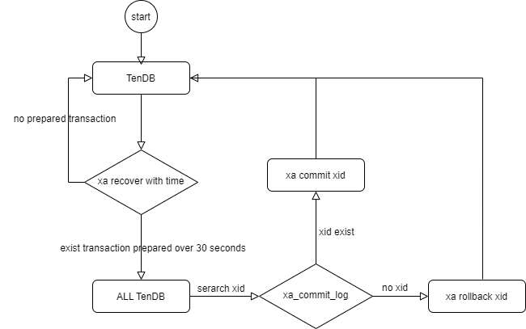

# TenDB Cluster事务

<a id="usage"></a>

TenDB Cluster支持事务（但不支持应用使用XA事务，不支持savepoint）。   
默认配置下，接入层TSpider只有在接受到应用的显示事务请求，才会以`start transaction/commit`的显示事务方式与存储层TenDB进行交互，这样仅能保证单分片上的事务特性。 在要求数据强一致的场景下，可以通过启用参数`spider_internal_xa`让TSpider使用XA协议和存储层TenDB进行交互，从而保证分布式场景下的事务。   
下面对TenDB Cluster上的事务进行详细说明。

<a id="jump2"></a>

## 事务使用

应用使用事务的方式和MySQL用法完全一致：
```sql 
begin/start transaction/set autocommit=0;
dml;
commit/rollback;
```
如果应用侧不显示使用事务，那就是隐式事务。另外TSpider不支持应用侧使用XA事务，不支持savepoint。

TSpider在接受到应用层的事务请求后，会将事务转发到对应的存储实例TenDB中执行。TSpider提供两种事务方式与存储实例交互，分别是 *普通事务* 和 *分布式事务* ，下面分别进行说明。

<a id="jump3"></a>

## 普通事务

默认配置下， TSpider会以隐式事务的方式将应用层的隐式事务进行转发。比如查询会转发为查询，更新同样会转发为对各个分片的更新。以一个基于非shard_key的update示例说明：   
表结构:
```sql 
mysql> show create table t1\G
*************************** 1. row ***************************
       Table: t1
Create Table: CREATE TABLE `t1` (
  `c1` int(11) NOT NULL,
  `c2` int(11) DEFAULT NULL,
  `c3` int(11) DEFAULT NULL,
  PRIMARY KEY (`c1`),
  KEY `k2` (`c2`)
) ENGINE=SPIDER DEFAULT CHARSET=utf8mb4
 PARTITION BY LIST (crc32(`c1`) MOD 4)
(PARTITION `pt0` VALUES IN (0) COMMENT = 'database "tendb_test_0", table "t1", server "SPT0"' ENGINE = SPIDER,
 PARTITION `pt1` VALUES IN (1) COMMENT = 'database "tendb_test_1", table "t1", server "SPT1"' ENGINE = SPIDER,
 PARTITION `pt2` VALUES IN (2) COMMENT = 'database "tendb_test_2", table "t1", server "SPT2"' ENGINE = SPIDER,
 PARTITION `pt3` VALUES IN (3) COMMENT = 'database "tendb_test_3", table "t1", server "SPT3"' ENGINE = SPIDER)
```
TSpider上的执行的请求：
```sql 
update t1 set c3=c3+1 where c2=1;
```
TSpider的分发到存储实例的请求为：
```sql 
update `tendb_test_0`.`t1` set `c3` = (`c3` + 1) where (`c2` = 1)
update `tendb_test_1`.`t1` set `c3` = (`c3` + 1) where (`c2` = 1)
update `tendb_test_2`.`t1` set `c3` = (`c3` + 1) where (`c2` = 1)
update `tendb_test_3`.`t1` set `c3` = (`c3` + 1) where (`c2` = 1)
```

同样的表结构，如果应用层使用显式事务，则TSpider会以显示事务的方式进行转发，示例如下：
在TSpider上的执行的请求：
```sql 
begin;
update t1 set c3=c3+1 where c2=1;
commit;
```
TSpider的分发到存储实例的请求为：
```sql 
begin // for SPT0
update `tendb_test_0`.`t1` set `c3` = (`c3` + 1) where (`c2` = 1)
begin // for SPT1
update `tendb_test_1`.`t1` set `c3` = (`c3` + 1) where (`c2` = 1)
begin // for SPT2
update `tendb_test_2`.`t1` set `c3` = (`c3` + 1) where (`c2` = 1)
begin // for SPT3
update `tendb_test_3`.`t1` set `c3` = (`c3` + 1) where (`c2` = 1)
commit // for SPT0
commit // for SPT1
commit // for SPT2
commit // for SPT3
```

普通事务的转发方式，只能保证单存储实例上的事务特性，不保证异常情况的集群事务。普通事务模式满足业务对数据强一制要求并不高的场景。另外，参数`spider_with_begin_commit`可以将应用的隐式事务，通过显示事务的方式和存储节点交互。

<a id="jump4"></a>

## 分布式事务

在事务使用中，如果对事务原子性、数据一致性要求很高，那么建议使用集群的分布式事务功能。启用分布式事务的参数是`SPIDER_INTERNAL_XA`, 在启用这个参数后TSpider通过XA协议与各存储实例交互，从而保证分布式事务。示例:
应用程序执行如下事务：
```sql 
begin; 
insert into t1(c1, c2) values(1, 2);
update t2 set c2=3 where c1=2;
commit;
```
TSpider对上述事务进行转换，使用XA协议与TenDB交互；对应SQL序列如下：（表t1有两个分片)
```sql 
TenDB1: xa start xid;
TenDB1: insert into rm1.t1(c1,c2) values(1,2); 
TenDB2: xa start xid;
TenDB2: update rm2.t2 set c2=3 where c1=2; 
TenDB1: xa end xid; xa prepare xid; 
TenDB2: xa end xid; xa prepare xid; 
TenDB1: xa commit xid one phase with logs; 
TenDB2: xa commit xid;
```
在应用开启事务后，执行的第一个请求(如上的insert)；TSpider会往后端发送xa start，并在路由到的节点执行insert； 后面每一个请求(如上的update)，TSpider都会往相关的TenDB节点发送请求； 应用发送commit/rollback，则TSpider使用xa end/xa prepare来预提交事务然后使用xa commit提交事务。

<a id="jump41"></a>

### **`xa commit xid one phase with logs`**

上述事务提交时，在TenDB1执行的提交语句是xa commit xid one phase with logs; 这个是TenDB实现的一个XA扩展功能。 该语句的作用是将xa事务提交，并将`xid`写入到本来的一个`mysql.xa_commit_log`中。    

**为什么需要记录这个xid的写入log呢 ？** 

因为XA事务在执行过程可能因为软硬件故障，导致存在xa prepare事务而不知道如何处理的情况；因此需要一个xa_commit_log作为参照，有写xa_commit_log的悬挂事务应该提交，没有写xa_commit_log的悬挂事务应该回滚。

<a id="jump42"></a>

### **参数`spider_trans_rollback`**

事务原子性定义如下：
> 事务的原子性是指组成一个事务的多个数据库操作是一个不可分割的原子单元，只有所有的操作执行成功，整个事务才提交。事务中的任何一个数据库操作失败，已经执行的任何操作都必须被撤销，让数据库返回初始状态。

但在MySQL InnoDB事务中，某个SQL执行出错，后面可以继续将执行成功的SQL的提交。
```sql 
mysql> select * from t1;
+----+------+
| c1 | c2   |
+----+------+
|  1 | a    |
|  2 | b    |
|  3 | c    |
+----+------+
3 rows in set (0.00 sec)

mysql> begin;
Query OK, 0 rows affected (0.00 sec)

mysql> insert into t1 values(4,'d');
Query OK, 1 row affected (0.00 sec)

mysql> update t1 set c2='aaa' where c3=1;
ERROR 1054 (42S22): Unknown column 'c3' in 'where clause'
mysql> commit;
Query OK, 0 rows affected (0.00 sec)

mysql> select * from t1;
+----+------+
| c1 | c2   |
+----+------+
|  1 | a    |
|  2 | b    |
|  3 | c    |
|  4 | d    |
+----+------+
4 rows in set (0.00 sec)
```
上述事务在TenDB Cluster中执行，同样是update语句执行出错；出错的原因会有很多种，但其中可能有一种是该update语句分发到后端某些分片执行成功且某些分片执行失败。   
如果依照InnoDB的事务提交特点，后面的事务可以继续提交或者回滚，那么很可能导致某个语句（如上的update)部分成功。   
因此如果严格遵循事务原子性，上述某个SQL执行失败后整个事务不能继续往下执行，直接回退。   
参数`spider_trans_rollback`打开后，即事务中某个SQL请求失败则事务自动回滚；保证要么全部成功，要么全部失败。

<a id="jump43"></a>

### **事务返回结果**

TenDB Cluster定义应用层事务的3种返回结果，分别是：**成功**，**失败**，**超时**。   
成功表示当前事务完全执行；   
失败表示当前事务失败且未修改数据；  
超时则表示当前事务可能成功也可能失败，需要业务主动确认。

<a id="jump44"></a>

### **悬挂事务处理**

TenDB中通过自己扩展的指令xa recover with time可以看到处于prepared状态的事务及该事务prepared状态持续的时间。   
TenDB Cluster定义处于prepare状态超时30秒的视为需要干预的悬挂事务。悬挂事务需要提交或者回退。  
在每个Tdbctl中会有一个后台线程探测当前集群中的TenDB是否存在PREPARED状态超过30秒的事务；只到探测存在PREPARED状态事务，然后去所有TenDB中查询该xid是否存在于提交日志xa_commit_log中，若存在于commit log则执行XA COMMIT xid，否则执行XA ROLLBACK xid。悬挂事务处理的流程图如下：




<a id="jump5"></a>

## 其它

### 忽略`autocommit=0`

一些应用可能无意使用了框架中默认的`aotocommit=0`（非预期），通过全局变量`spider_ignore_autocommit`，在正在执行的事务提交后，主动设置`autocommit=1`让后续query都变成自动提交。
> 将SPIDER_IGNORE_AUTOCOMMIT打开，这个参数打开表示忽略应用中分发的set autocommit=0；


### 不支持`save_point`示例

```
MariaDB [test1]> create table t1(c1 int primary key);
Query OK, 0 rows affected (0.03 sec)

MariaDB [test1]> begin;
Query OK, 0 rows affected (0.00 sec)

MariaDB [test1]> insert into t1 values(1);
Query OK, 1 row affected (0.00 sec)

MariaDB [test1]> savepoint a;
ERROR 1178 (42000): The storage engine for the table doesn't support SAVEPOINT

```