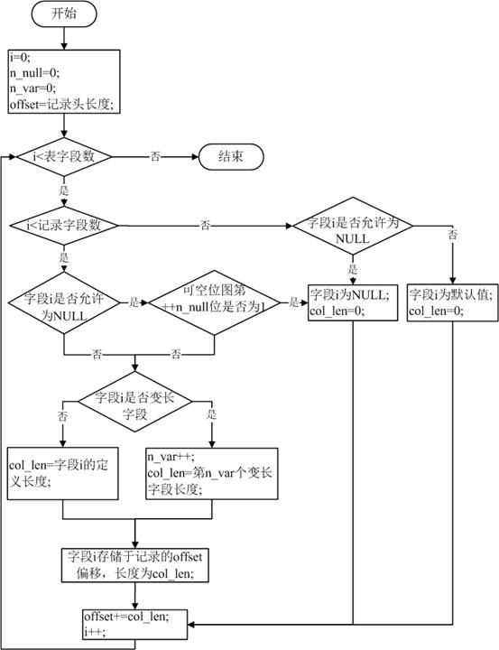

# TenDB在线加字段
在实际应用中，除了正常DML相关操作，应用也会存在很多在线DDL操作，不同于DML操作，DDL因为涉及到表结构的变化，会有数据重构的过程，在某些场景会阻塞表的写操作，影响应用。在MySQL不同版本中，对在线DDL的处理也是不同的，常见的处理方式有如下几种  
1. COPY TABLE  
通过临时表拷贝的方式实现，新建一个目标表结构的临时表，将原数据拷贝完成后，执行rename操作; 整个操作过程中原表可读，但是不可写，会消耗一倍左右的存储空间
2. INPLACE  
在原表上直接进行，不会拷贝临时表。相比COPY TABLE效率更高，但是限定条件也比较多，而且整个操作过程中原表也是不可写的  
3. ONLINE  
MySQL5.6以上版本提供的方式，与原来两种方式相比，在整个DDL期间，原表是可读可写的  

如果对MySQL ONLINE了解比较深入的话，会发现ONLINE DDL实际会有短暂锁表的存在，在并发较大场景可能存在锁表超时而DDL失败；同时因为并发较大会产生大量的增量数据，在应用这些增量数据rebuild表时是阻塞写操作的。  
不同于ONLINE DDL的加字段行为，TenDB在线加字段通过扩展数据字典存储格式，识别在线加字段的操作行为来实现，对符合在线加字段的操作，做到秒级完成，从根本上解决了在线加字段耗时较长的问题

## TenDB在线加字段示例
```sql
mysql> create table t(a int, b int);
Query OK, 0 rows affected (0.00 sec)

mysql> insert into t values(1,2); 
Query OK, 1 row affected (0.00 sec)

mysql> alter table t add column(c int);
Query OK, 0 rows affected (0.00 sec)
Records: 0  Duplicates: 0  Warnings: 0

#查看结果
mysql> select * from t;
+------+------+------+
| a    | b    | c    |
+------+------+------+
|    1 |    2 | NULL |
+------+------+------+
1 row in set (0.00 sec)
```

## TenDB在线加字段原理
InnoDB作为MySQL最常用的事务性存储引擎，为了满足不同应用场景的性能需求，提供了四种行格式，分别为Redudant、Compact、Dynamic和Compressed，并且Compact是官方MySQL版本的默认存储格式。其中TenDB是通过扩展Compact、Dynamic的记录头来记录在线加字段的信息，来实现快速加字段的。 

### 记录格式
下面以Compact格式为例讲解在线加字段的实现细节  
Compact聚集索引记录的格式如下图，由记录头和记录内容组成。其中 ，“主键外的其他非空字段”的存储顺序与列定义顺序一致。


记录头记录了解析字段的关键信息，其结构为下图所示  


-  Record Extra Bytes：是固定的5字节，表示记录的额外信息
-  Nullable Bitmap：记录可空位图，使用1个bit来表示一个可空字段是否为NULL
- non-NULL Variable-Length Array：非空变长字段数组，表示非空变长字段（如varchar、varbinary）在该行的长度

为了表示新字段的信息，只需要在Compact格式上更改记录头，改造后如下图所示


新增加的Field Count表示插入该行时表的字段个数，占用1~2个字节（如果字段数超过127，就是用2字节）。假设某记录的Field count记录为x，表字段数为y，那么x <= y总是成立的。对于改造后的格式，字段的解析变为：

 * 如果x == y，按原来的方式解析  
 * 如果x < y，那么记录必定是在AlTER
  TABLE ADD COLUMN前就生成，那么最后y - x个字段必为NULL或默认值
   - 如果该字段是允许为NULL，则为NULL
   - 如果该字段不允许为NULL，则为默认值  

整个记录的解析流程如下




行格式新增的Field Count是为了表示记录的字段数，如果表不执行加字段操作，该部分其实是不起作用的。因此表不执行快速加字段操作的话，记录中并不需要存储Field Count信息，可存储在扩展的数据字典中，这样在线加字段前，可以减少数据记录Field Count 带来的1~2字节的存储消耗  
经过对Compact格式的改造, 解决了存储格式上解析新增字段的难题，也是在线加字段功能得以支持的关键。  

### 数据字典
InnoDB关于列的数据字典中并不包含默认值信息，默认值是存储在MySQL层的frm文件中  
为了支持默认值的加字段操作，InnoDB存储引擎层需要存储新增列的默认值信息。一种办法是在原`SYS_COLUMNS`表增加`def_val`属性，表示默认值。但这必会带来跟官方版本兼容性问题，并且不是所有列的默认值都需要存储的，只需保存新增列的默认值信息。因此增一个系统表`SYS_ADDED_COLS_DEFAULT`，保存新增列的默认值，并通过(`tableid`,`pos`)与`SYS_COLUMNS`的列信息关联起来, 表结构信息如下
```sql
CREATE TEMPORARY TABLE `INNODB_SYS_ADDED_COLS_DEFAULT` (
  `TABLE_ID` bigint(21) unsigned NOT NULL DEFAULT '0',
  `POS` int(11) unsigned NOT NULL DEFAULT '0',
  `DEF_VAL` blob,
  `DEF_VAL_LEN` int(11) unsigned NOT NULL DEFAULT '0'
) ENGINE=InnoDB DEFAULT CHARSET=utf8
);
```
表各字段说明如下

| 列名 | 	说明|
| :--- | :----|
|table_id|表的唯一标识|
|pos|列号|
|def_val|默认值的内容，以二进制保存，默认值的最大长度是65535，由上层frm格式保证；对于数字类型，使用大端存储；对于字符/二进制，均使用字节流保存。|
|def_val_len|默认值占用的存储空间|
默认值为NULL（无not null约束）的新增字段，不需记录在`SYS_ADDED_COLS_DEFAULT`字典表中，因为redundant格式`NULL`记录的`DEF_VAL`占用长度为65535，插入会报`row_size_too_big`。

为了实现与官方版本兼容，SYS_ADDED_COLS_DEFAULT使用动态创建功能，即TenDB启动加载数据字典子系统时发现该表不存在，会动态创建。这样，从官方版本升级原地升级为TenDB时就不需考虑该表导致的不兼容问题

### 在线加字段流程
TenDB扩展的行格式支持在原数据不改变的情况下解析新增字段，并且可以在原表上直接修改元数据，不需拷贝数据。因此，加字段时间可以大大缩短。

在线加字段的过程为：  
1. 目标表T1上字典锁(SHARED_NO_WRITE), 阻塞所有写操作
2. 判断是否符合在线加字段的条件，如符合，执行步骤3，否则按照官方拷贝数据的方式来新增字段
3. 创建跟目标表T1同构的临时表frm文件S1.frm（含新增字段）
4. 目标表T1的字典锁升级为排它锁，所有关于T1表的所有读写操作被阻塞
5. 修改T1表InnoDB内部数据字典信息，增加新字段。
6. 将S1.frm重命名为T1.frm
7. 释放表T1的字典锁

从上述流程可以看到，TenDB在线加字段取消了可能导致时间过长的数据拷贝过程或者应用增量数据带来的锁表问题，同时不需要新建表，只需生成相应frm文件即可。在线加字段在大部分情况下都能马上返回，实现真正的在线操作。  
另外，基于在线加字段操作，TenDB开发了一个Online DDL操作的执行框架，其他存储格式上支持的online操作可以很容易地扩展，如已实现的分区表在线加字段，未来TenDB实现的online rename column，online modify column等。

## 在线加字段限制
- redundant和compressed行格式不支持
- 一次alter table仅允许加一列或多列，但不允许同时进行多个alter table的不同操作（如增删索引、删字段、修改字段等）
- 不支持指定FIRST或AFTER关键字表示定义在某列之前或之后
- 不能包含除not null外的任何约束，包括外键约束、唯一约束
- 不支持允许为NULL并指定默认值的加字段操作
- 所加字段不能自增列(auto_increment)
- 表包含全文索引
- 表包含地理信息索引
- 增加Percona压缩字段
- 快速加过字段的表不能执行flush tables xx for export
- 快速加过字段的表不能执行alter table xx discard tablespace

## 其他说明
目前TenDB不支持允许为NULL并指定默认值的加字段操作，实际上是可以做到支持的。
即不再区分列是否为空，全部从内存中的数据字典获取，不过需要确保以下两点 
- innobase_add_one_instant：对于默认值为NULL的信息，不插入SYS_ADDED_COLS_DEFAULT
- dict_load_added_cols_default：对于在SYS_ADDED_COLS_DEFAULT表中没有记录的新增字段，就是默认值为NULL，同时保证dict_col_default_t中一定有值，并且值为NULL